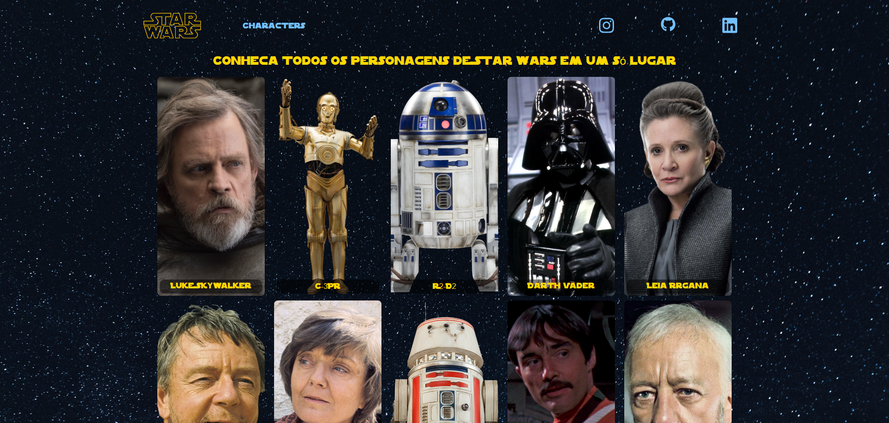
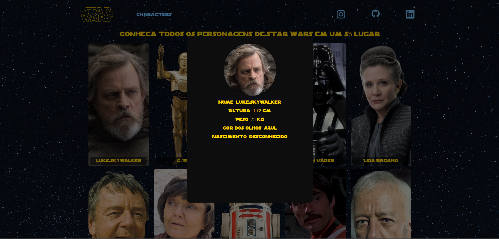

# 🚀 Star Wars Project

Uma aplicação web interativa que consome uma API de personagens do universo Star Wars, exibindo informações de forma dinâmica e visual.

---

## 📸 Preview




---

## 🧠 Sobre o projeto

Este projeto foi desenvolvido com foco em prática de consumo de APIs e manipulação de DOM utilizando JavaScript puro.

A aplicação permite visualizar personagens de Star Wars em formato de cards, com detalhes exibidos em um modal interativo.

---

## ⚙️ Tecnologias utilizadas

* HTML5
* CSS3
* JavaScript
* API REST (Akabab Star Wars API)

---

## 🔥 Funcionalidades

✔ Listagem de personagens
✔ Paginação no front-end
✔ Exibição de imagens dos personagens
✔ Modal com detalhes (nome, altura, peso, etc.)
✔ Interface responsiva
✔ Manipulação dinâmica do DOM

---

## 🧩 Conceitos aplicados

* Consumo de API com `fetch`
* Manipulação de arrays (`slice`, `forEach`)
* Estruturação de código em funções reutilizáveis
* Eventos (click, load)
* Controle de estado no front-end
* Responsividade com CSS

---

## 📁 Estrutura do projeto

```
/project
 ├── index.html
 ├── style.css
 ├── script.js
 └── assets/
```

---

## 🚀 Como rodar o projeto

1. Clone o repositório:

```bash
git clone https://github.com/seu-usuario/Star-Wars-Project.git
```

2. Acesse a pasta:

```bash
cd Star-Wars-Project
```

3. Abra o `index.html` no navegador

---

## 🎯 Próximos passos (melhorias futuras)

* 🔍 Implementar busca de personagens
* 🎨 Melhorias de UI/UX
* 🌙 Modo dark/light
* ⚛️ Migrar para React

---

## 👨‍💻 Autor

Desenvolvido por **Lucas Henrique**

🔗 GitHub: https://github.com/LucasHenrique-d

---

## 🧠 Observação

Este projeto foi desenvolvido para fins de estudo e prática de desenvolvimento front-end.
